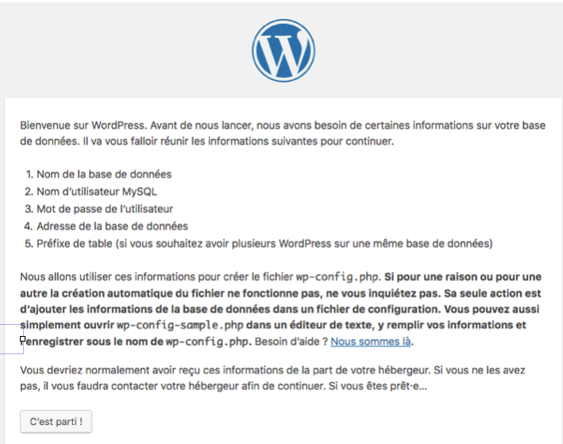
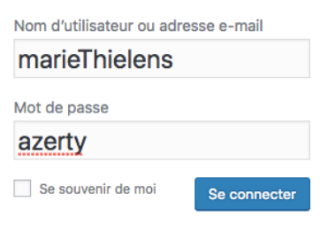

# Installation de WordPress et bases

WordPress est le CMS le plus répandu actuellement sur le web ( on parle de plus de 30% de parts de marché source). Cette popularité en fait un outil intéressant pour le déploiement rapide. De plus, il n'est pas rare que votre client aie déjà utilisé WordPress, ce qui a l'avantage qu'il connaisse déjà son futur outil.

WordPress nécessite PHP et MySQL. À l'origine, c'était surtout un outil pour gérer un blog, donc un journal personnel, en ligne. C'est pourquoi, quand on installe WordPress, on peut par défaut créer des articles et des pages, et avoir des commentaires sous ses articles. Avec le temps, l'outil est devenu hyper flexible et si on sait coder (comme toi), on peut à peu près tout faire avec WordPress.

Au terme de ce parcours, tu seras capable de créer un premier site "custom" sur WordPress et son écosystème commencera à t'être familier. Ce n'est que du PHP, du SQL, du HTML, du CSS et du javascript après tout !

## 1. installer WordPress

1. Téléchargez worpdpress sur le site officiel : https://fr.wordpress.org/download/ ou en Anglais : https://wordpress.org/download/ 

2. Décompressez le zip et mettez le dossier décompressé dans votre dossier htdocs (comme le fichier principal est un fichier php nous auront besoin d’être dans htdocs pour que mon fichier soit interprété).

3. Renommez le dossier pour plus de compréhension : `premierWordpress`

( WordPress existe comme un service en ligne : http://wordpress.com et comme un package à installer soi-même )

### Installer WordPress sous Ubuntu

- Installez Apache2 sudo apt install apache2.
- Lancez Apache sudo systemctl start apache2. La commande pour l'arrêter est sudo systemctl stop apache2
- Mettez le dossier WorPress que vous avez téléchargé dans le dossier var/www

## 2. Créer une base de donnée

1. Avant de lancer wordpress il faut créer une base de donnée : créez une base de donnée sur localhost/phpmyadmin/ . (N’oubliez pas de lancer xampp ou mamp au préalable)

- Nom de la base : nomDeVotreChoix ( `premierWordpress` )
- Interclassent : `utf8_unicode_ci`

( Si vous voulez modifier le mot de passe ou le nom de la base de donnée il se trouve dans le fichier wp-config.php )

## 3. Finir l'installation de wordpress

Dans votre navigateur (chrome, explorer, n’importe) mettez `localhost/premierWordpress`

C'est parti !

## 4. Saisir les informations pour lier wordpress à la base de donnée MySQL

Ici il s’agit de rentrer les informations de la base de donnée :

- Son nom : nom de la base de donnée 
- Identifiant (par défaut c’est root)
- Le mot de passe (par défaut c’est root)
- L’adresse de la base de donnée (là on travaille en localhost).
- Préfixe des tables : Je change son nom car c’est une pratique importante à prendre pour se protéger des pirates.

- validez.

## 5. Connenxion à WordPress : allons voir la bête

Notez vos infos de connexion quelque part. On a vite fait d'oublier ...

## Installation sous ubuntu

- Connaitre cotre adresse ip sous linux : `hostname I`
- mettre en mode super user : `ssh root@your_server_ip` 
Si vous avez ce résultat : ssh: connect to host 10.20.0.232 port 22: Connection refused
- sudo apt-get update
- sudo apt-get install openssh-server
- sudo ufw allow 22

1. Installer SQL sudo apt-get install mysql-server mysql-client

1. Se connecter à la base de donnée SQL : `sudo mysql -u root -p` . Entrez votre mot de passe utilisteur (celui de votre machine) et ensuite le mot de passe de l'utilisateur root de la base de donnée (root).
2. Créer une base de donnée : `CREATE DATABASE nomDeLaBaseDeDonnee`;
3.Créer un nouvel utilisateur SQL: `CREATE USER marie@localhost IDENTIFIED BY 'votreMotDePasse'`; C'est une bonne pratique à prendre. Sinon n'importe quel pirate sait le mot de passe de l'utilisateur root (qui est l'utilisateur par défaut). `CREATE USER marie@localhost IDENTIFIED BY 'azerty'`
3. Donner tout les privilèges GRANT ALL PRIVILEGES ON nomDeLaBaseDeDonnee.* TO marie@localhost;
GRANT ALL PRIVILEGES ON coucou.* TO marie@localhost

DROP USER ‘identifiant’@’serveur’;

set PATH=%PATH%;/opt/lampp/mysql