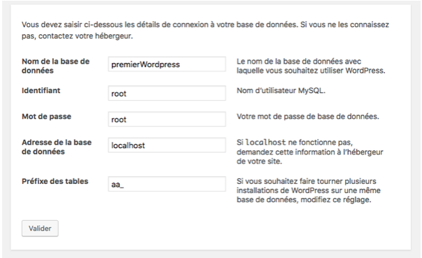
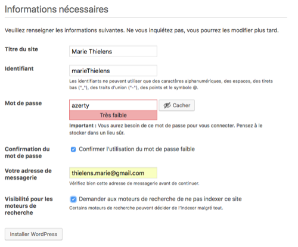

# Installation de WordPress et bases

WordPress est le CMS le plus répandu actuellement sur le web ( on parle de plus de 30% de parts de marché source). Cette popularité en fait un outil intéressant pour le déploiement rapide. De plus, il n'est pas rare que votre client aie déjà utilisé WordPress, ce qui a l'avantage qu'il connaisse déjà son futur outil.

WordPress nécessite PHP et MySQL. À l'origine, c'était surtout un outil pour gérer un blog, donc un journal personnel, en ligne. C'est pourquoi, quand on installe WordPress, on peut par défaut créer des articles et des pages, et avoir des commentaires sous ses articles. Avec le temps, l'outil est devenu hyper flexible et si on sait coder (comme toi), on peut à peu près tout faire avec WordPress.

Au terme de ce parcours, tu seras capable de créer un premier site "custom" sur WordPress et son écosystème commencera à t'être familier. Ce n'est que du PHP, du SQL, du HTML, du CSS et du javascript après tout !

## 1. installer Wordpress

1. Téléchargez worpdpress sur le site officiel : https://fr.wordpress.org/download/ 

2. Décompressez le zip dans votre dossier htdocs (comme le fichier principal est un fichier php nous auront besoin d’être dans htdocs pour que mon fichier soit interprété)

( WordPress existe comme un service en ligne : http://wordpress.com et comme un package à installer soi-même )

## 2. Créer une base de donnée (localhost/phpmyadmin)

1. Avant de lancer wordpress il faut créer une base de donnée : créez une base de donnée sur localhost/phpmyadmin/ . (N’oubliez pas de lancer xampp ou mamp au préalable)

- Nom de la base : nomDeVotreChoix
- Interclassent : utf8_unicode_ci

Si vous voulez modifier le mot de passe ou le nom de la base de donnée : wp-config.php

Modifier le nom de votre dossier et lancerwordpress dans le navigateur

1. Renommez le dossier que vous avez téléchargé et placé dans votre htdocs. Moi je l’ai appelé comme ma base de donnée : nomDeVotreChoix (ex: premierWordpress)  

2. Dans votre navigateur (chrome, explorer, n’importe) mettez localhost/premierWordpress

## 3. Saisir les informations pour lier wordpress à la base de donnée MySQL 

Ici il s’agit de rentrer les informations de la base de donnée :

- Son nom : nom de la base de donnée 
- Identifiant (par défaut c’est root)
- Le mot de passe (par défaut c’est root)
- L’adresse de la base de donnée (là on travaille en localhost).
- Préfixe des tables : Je change son nom car c’est une pratique importante à prendre pour se protéger des pirates.

- validez.

- Titre du site :
- Identifiant : 
- Mot de passe : 
- Votre messagerie : 
- Visibilité pour les moteurs de recherche : 