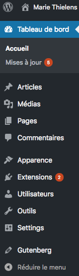
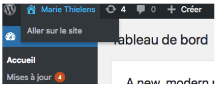
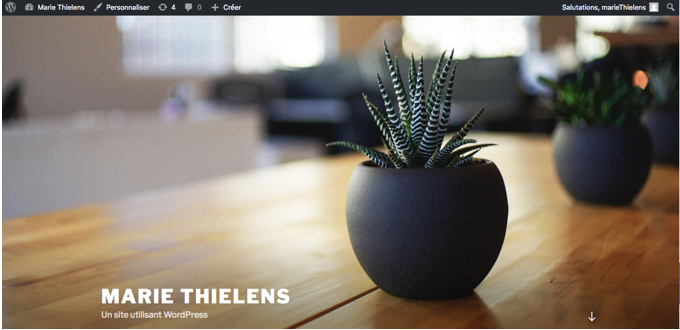
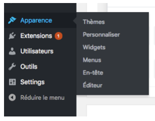
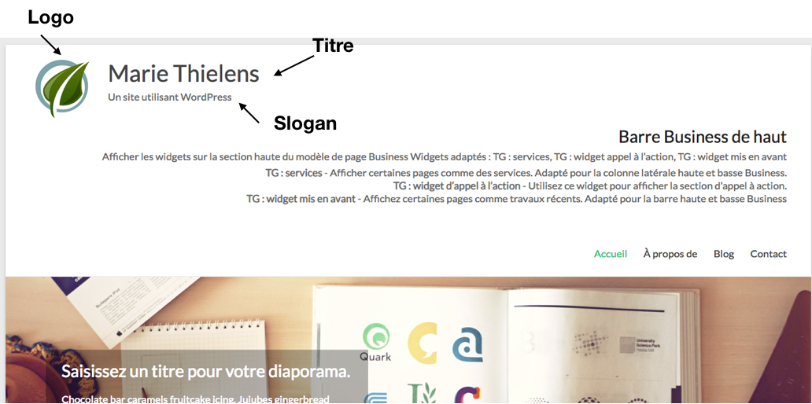
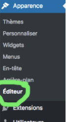

# Présentation du tableau de bord et de la barre latérale

## Tableau de bord

Une fois que vous avez entré vos identifiants, vous arrivez sur l’interface d’accueil de WordPress appelée `Tableau de bord` . C’est la page d’accueil de WordPress qui va vous permettre en un coup d’oeil de connaître l’activité récente de votre site. A partir de là,vous pourrez gérer intégralement le contenu de votre site.
 
## La barre latérale

La barre latérale de WordPress est le menu de navigation de l’administration. Il reprend les différentes fonctionnalités qui vont vous permettre d’effectuer des actions. Lorsque vous cliquez sur un menu, il s’ouvrira pour faire apparaitre d’autres fonctionnalités qui lui sont dépendants.



Par défaut, les menus sont les suivants :

- Tableau de bord
- Articles
- Médias
- Pages
- Commentaires
- Apparence
- Extensions
- Utilisateurs
- Outils
- Réglages

Ce menu peut-être différent selon les sites, vous pouvez en avoir en plus si vous avez des plugins installés sur votre WordPress.

WordPress vous offre la possibilité de réduire le menu si vous trouvez que celui-ci prend trop de place.

# Thèmes

Le `thème` est le visuel de notre site, son apparence.
Voyons à quoi ressemble notre site pour le moment :



En haut à gauche vous avez le `titre de votre site` . Cliquez dessus et allez voir à quoi ça ressemble.. Cliquer sur le titre de votre site permet de passer du tableau de bord 



### Personnaliser votre thème

Retournons au tableau de bord pour changer le thème. Nous allons en télécharger un nouveau.

`Thème` se trouve à gauche dans `Apparence`



Cliquez sur `+ Ajouter un thème` . Cela va vous permettre de télacharger un nouveau thème. 

Moi j'ai choisi un thème qui convient à un portfolio : `Spacious` . Soit vous téléchagez celui-là où un autre qui vous plait. Il s'agit juste de découvrir la bête..

1. Installez-le
2. Activez-le
3. Regardez à quoi il ressemble
4. (Oups, si tu ne te souviens plus on l'a vu juste un peu plus haut...)



### Modifier le slogan du site, son nom et son logo

Dans la barre latérale cliquez sur `Apparence / Personnaliser`. L'onglet porte bien son nom car nous allons modifier l'apparence de notre site. C'est là aussi que se trouve le css, les menus et pleins d'autres choses. Voyez par vous-même.

Varie selon les thèmes :

- __identité du site__ : Nom du site, logo, sloggan,Icône du site etc.. 
- __Couleur__ : couleur fonc, texte etc..
- __Image d'en-tête__
- __Menus__ : Navigation
- __Widgets__ : barre de recherche, articles etc..
- __Réglages de la page d'accueil__
- __CSS additionnel__

Pour modifier le logo, le slogan et l'icône du site il faut donc aller sur l'onglet `identité du site`

#### 1. Modifiez le slogan

- Modifiez le slogan. Voyez ça comme une description. Par exemple mon premier cv. ou Web Developer.
- Sauvegardez ! Vous remarquerez un gros bouton bleu `Publier`. C'est le bouton de sauvegarde. 

#### 2. Changez le logo

- Vous pouvez télécharger un logo sur google ou créer votre propre logo
- Importez votre image dans WordPress.

Il y a un bouton `Changer le logo` qui va vous permettre de choisir une image dans votre bibilothèque ou d'en importer une. `Téléverser des fichiers`.

_Une fois qu’une image est téléchargée, elle reste dans wordpress  et je peux effacer l’original (l’image sur mon ordi) si ça me chante. C’est pour que vous le sachiez mais mieux vaut garder une copie.._

- Rajoutez un texte alternatif

Le texte alternatif (ou alt Text) est l’un des éléments les plus important pour l’optimisation de vos images. Le alt Text fournit aux moteurs de recherche un moyen de comprendre vos images. Pour Google, c’est un facteur important dans la recherche d’images.

Mais ce n’est pas tout.

Le alt Text s’affiche aussi sur la page si votre image ne parvient pas à se charger. Enfin, il est également utilisé par les lecteurs d’écran pour les malvoyants

#### 3. Mon logo est trop grand, modifier sa taille grâce au css additionnel ?

Vous avez un onglet `CSS additionnel`. Je peux par exemple mettre se code qui met un fond rouge partout

```html
*{
	background-color:red;
}
```
Et cela fonctionne. Mais quelques remarques complémentaires toutefois :

- Limitez-vous à quelques lignes seulement : cet outil n’a pas vocation à remplacer une véritable feuille de styles et ce, pour des raisons évidentes liées à la performance. Pour modifier en profondeur votre code CSS, utilisez un `thème enfant` ;

- Les données sont propres au thème actif. En cas de changement de thème, le code personnalisé ne sera donc pas appliqué ;

- Il s'agit d'un css additionnel, il vaut mieux travailler sur le css qui se trouve à la racine


#### 4. Le css

Il se trouve dans `Apparence / Editeur`




_Le seul hic, c’est que la modification, même infime, d’un thème vous empêche de faire sa mise à jour vers une nouvelle version à l’avenir, parce que si vous mettez à jour, alors vous perdez toutes vos modifications :/_  

Il faut que nous créions un thème enfant.
