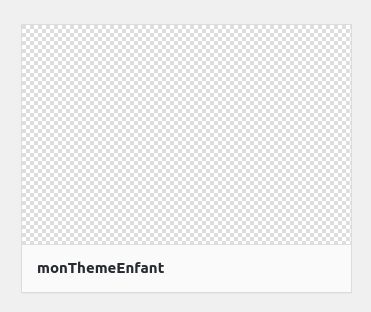
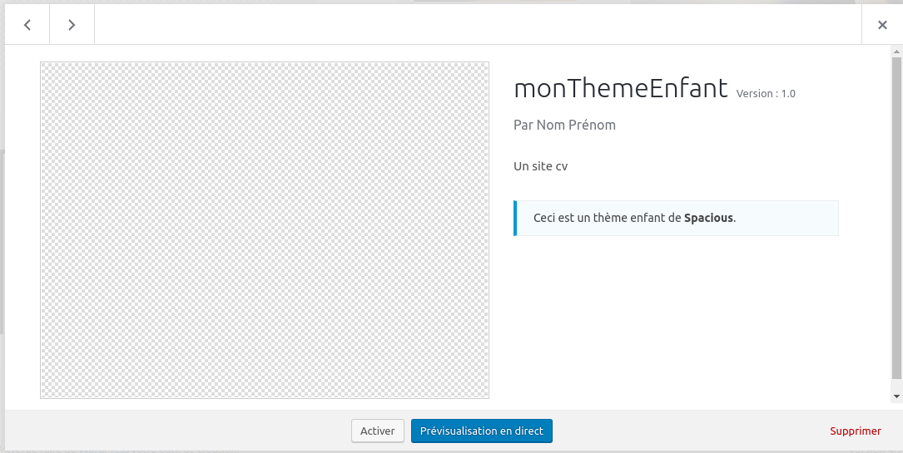
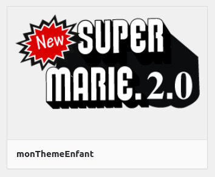
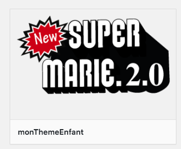
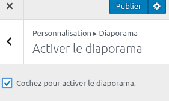
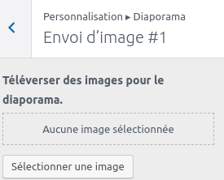
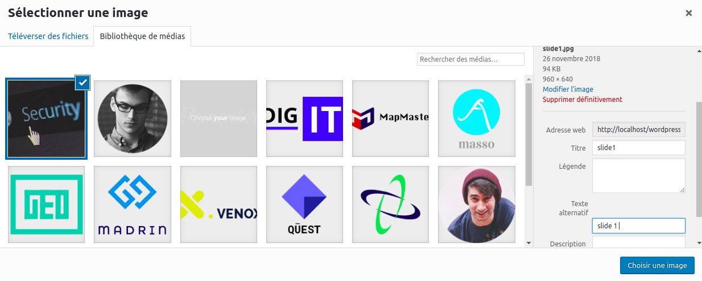
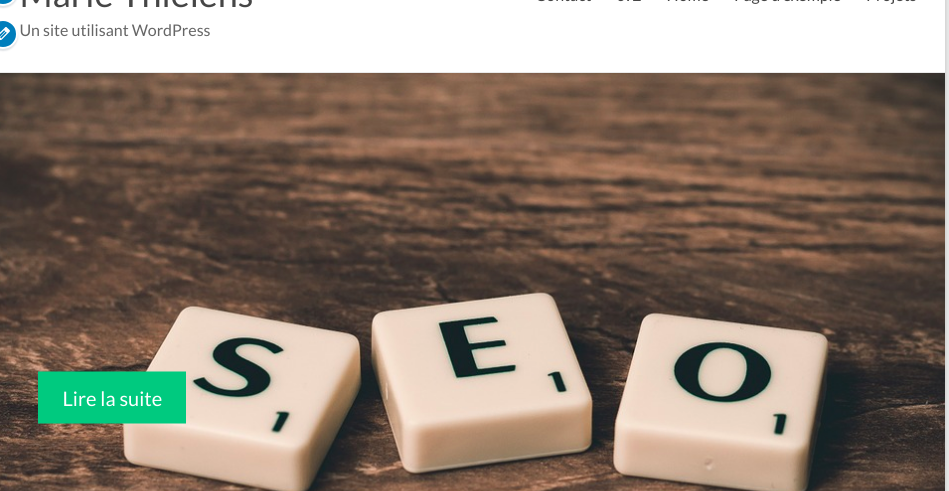

# Thème enfant 

## Un thème enfant c'est quoi ?

Un thème enfant est un thème basé sur votre thème parent. Comme si j'en faisais une copie. L'avantage majeur est de pouvoir bénéficier des mises à jour du thème parent tout en poursuivant les changements sur le thème enfant.
Ainsi vous pouvez apporter des modifications à votre enfant et en cas de mise à jour du parent, vous ne les perdez pas !

## Créer un thème enfant

Dans le dossier **wp-content / themes** créez un dossier **spacious_child**

Pour créer un thème enfant notre dossier à obligatoirement besoin de 2 fichiers. 

1. un fichier style.css
2. un fichier functions.php

Créez-les dans votre dossier **spacious_child**

- Il existe un site qui génère des thèmes enfant <a href="https://wpmarmite.com/creer-theme-enfant/">wpmarmite.com/creer-thème-enfant</a>

### Le ficher style.css

Fichier obligatoire. C’est un endroit ou modifier le css mais c’est plus que ça pour WordPress ! Le fichier style.css permet de déclarer le thème auprès de WordPress et de lui dire qui est le thème parent.

```CSS
/*
Theme Name: monThemeEnfant
Description: Un site cv
Author: Nom Prénom
Template: spacious
Version: 1.0
*/
```

Explications :

- `Theme Name` : Le nom que je veux donner a mon thème enfant. (obligatoire)
- `Description` : La description de mon thème enfant celle qui apparaîtra dans mon gestionnaire de thème WordPress
- `Author` : L’auteur du thème enfant, en l’occurrence c’est vous. Mettez votre site perso ou votre GitHub
- `Author URI` : L’url du site de l’auteur parce qu’un peu de pub ne fait pas de mal
- `Template` : Le nom du thème parent (obligatoire).
- `Version` : La version, à titre indicatif.

<p style="color:red;">Ne jamais mettre d’espace avant les deux points</p>

Voyez dans votre WordPress, votre thème est maintenant visible dans Apparence/theme

 Si vous cliquez dessus :  

### Le Fichier screenshot.png : une capture d'écran pour votre thème

screenshot.png (une image format jpg d'une dimension de 1200 x 900 pixels) Vous pouvez dans un premier temps garder celle généreé par wordpress ou en créer une vous-même. 

- Vous pouvez aussi prendre mon logo qui se nomme screenshot.png

Retournez dans WordPress Apparence/theme, vous avez maintenant une miniature, une image pour votre thème



### Le fichier functions

Code qui permet d’appeler le style.css (donc le style) du thème parent.

```PHP
<?php
// lien vers le css

function fonctionAppelCss(){
    wp_enqueue_style('style_de_mon_parent', get_template_directory_uri() . '/style.css'  );
}
add_action('wp_enqueue_scripts', 'fonctionAppelCss');
```

La fonction va tout simplement récupérer le fichier style.css du thème parent, celle du thème enfant se chargeant après.

Dans le cas où votre thème repose sur plusieurs fichiers de styles CSS, le code présenté ici ne suffira pas et il conviendra de gérer des dépendances. Si vous êtes à l’aise avec la fonction wp_enqueue_style vous devriez vous en sortir sans encombres. Pour les autres, l’ancienne méthode reste bien plus simple à mettre en oeuvre.

### Voilà, votre thème enfant est prêt, activez-le

- Activez votre thème dans `Apparence/Thèmes`



Le thème enfant va ainsi hériter de l’ensemble des fonctionnalités du thème parent. De fait, seuls les fichiers qui seront ajoutés dans le dossier du thème enfant surpasseront ceux du thème parent.

Avertissement pour le fichier functions.php
Contrairement aux autres fichiers du thèmes (index.php, single.php, etc.), le functions.php ne sera pas écrasé par celui du thème enfant – si par cas il existe. Il sera au contraire charger juste avant le functions.php du thème parent. Vous pouvez donc ajouter des fonctionnalités au thème parent sans casser ce dernier.

Utiliser un child theme est un véritable gain de temps tant pour le développeur que pour le webmaster qui n’auront plus à se soucier des modifications apportées. Un thème source propre en termes de code et un thème enfant pour le personnaliser à souhait. Ingénieux, non ?

## Modifier notre thème pour qu'il ressemble un peu plus à quelque chose

### Rajouter des images pour mon slider

Vous pouvez aller sur le site [pixabay](https://pixabay.com/fr/plans-design-conception-de-sites-web-1867745/) qui propose des images libres de droit. 

Choisissez en 3 (moi j'ai tapé web dans la barre de recherche) ensuite allez dans **Apparence/personnaliser** et choississez l'onglet **Diaporama**


- 1. Activez le diaporama



- 2. Envoyez vos images avec l'onglet Envoi d'image #


    
    - Cliquez sur le bouton : **Séléctionner une image**

Allez sur téléverser une image (pour uploader une image qui est sur votre machine et la mettre dans la bibliothèque d'image de WordPress). Une fois l'image téléversée vous pouvez l'éffacer de votre ordinateur si vous le souhaitez. elle est maintenant dans WordPress :) 



    - Pensez à mettre le texte alternatif qui représente souvent le alt de l'image
    - Faites en de même avec les autres images
    - Pensez à sauvegarder en cliquant sur le gros bouton bleu Publier

Vous voilà avec un joli slide : 



