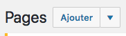

# Les pages et introduction aux extensions (aussi appelé plugins)

## Différence entre article et page

WordPress permet de créer deux types de contenus principaux, les articles (ou « posts ») et les pages. Imaginez que WordPress est un magasine papier. Vous aurez des pages et sur certaines de ces pages des articles..

En savoir plus : https://wpmarmite.com/difference-article-page-wordpress/ 

Nous en relarlons au chapitre suivant.

## Les pages

- allez sur `l'onglet Pages` et rajoutez une page Contact
 

Ce serait sympa de rajouter un formulaire de contact sur cette page. Au lieu de faire nous même le formulaire nous allons télécharger un plugin (aussi appelé extension).

- Créeons d'autre pages. En tout nous auront une page Accueil, Compétences, Contact, Formations et Projets. Ce sont des pages que l'on retrouve dans la plupart des site cv.

## Les plugins

Le menu Extensions est dédié à la gestion des plugins et de l’installation des Widgets.

- Installez l'extension Contact Form 7

- Activez-le. Comme la plupart des extensions, vous pouvez remarquer que celle-ci s’ajoute sur la barre latérale gauche de votre Dashboard en tant que `Contact`.

En savoir plus sur Contact Form 7 : https://wpformation.com/contact-form-7-tuto/

- Voir chapitre suivant : liste d'extensions

25 plugins indispensable : https://wpchannel.com/wordpress/plugins-wordpress/25-plugins-wordpress-indispensables/ 

