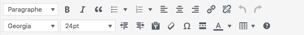
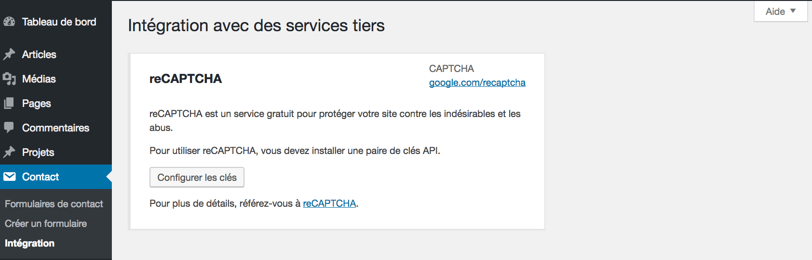
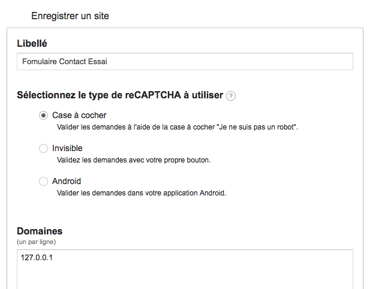
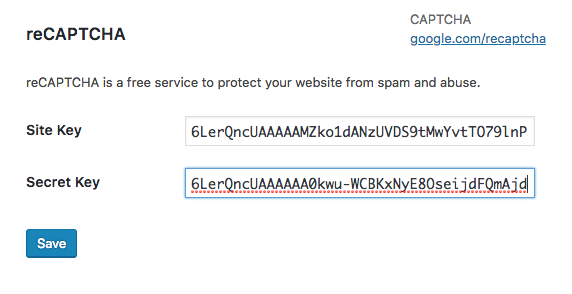

# Les extensions

|           Nom du plugin        |    Fonction du plugin   |
-|:-: |
| TinyMCE Advanced  |  Ce plugin gratuit va vous permettre d’ajouter, de supprimer et de réorganiser les “boutons” de la barre d’outils de l’éditeur de votre site WordPress |
| BackWPup  |  Il permet de programmer des sauvegardes automatiques à intervalles réguliers. |
| Google Analytics for Wordpress | Analytics est le service le plus utilisé pour mesurer l'audience d'un site web. |
| Contact Form 7 |  Un formulaire de contact        |
| WordPress SEO     |   Pour le référencement        |
| WP Optimize      |     Ce plugin permet d'optimiser un peu le chargement des pages par rapport à l'utilisation que vous faites de votre site.       |
| Akismet     |     Ce plugin permet d'éviter le spam dans les commentaires       |
| Broken Link Checker    |  Ce plugin vous permettra de repérer les liens morts et donc de les corriger. Attention toutefois : il est assez gourmand en ressources.|
| Follow Us Box   |     Cette extension permet d'ajouter facilement une zone dans laquelle vous retrouvez les activités de la page Facebook liée à votre site.      |
| Cookie Notice   |   Une directive européenne oblige les sites à prévenir leurs visiteurs qu'ils utilisent des cookies (ces petits fichiers sauvegardés sur votre disque dur qui gardent une trace de votre activité en ligne). Vous avez d'ailleurs certainement déjà vu un bandeau indiquant que le site que vous visitez utilise des cookies. Ce plugin permet d'afficher un message en ce sens à vos utilisateurs.       |
| W3 Total Cache     |    Ce plugin vous permettra d'améliorer le temps de chargement de vos pages en gérant leur mise en cache. |
| Login Lockdown    |   Nous avons évoqué ce plugin dans le premier chapitre : il permet de limiter le nombre de tentatives de connexion infructueuses à l'interface d'administration. |
| Theme Authenticity Checker | Ce plugin vérifie qu'il n'y a pas de code malveillant inclut dans les thèmes que vous souhaitez installer. |

## TinyMCE Advanced

## Contact Form 7

Tuto : https://wpformation.com/contact-form-7-tuto/

### reCaptcha. Êtes-vous un robot ?

Tout d’abord, rendez-vous dans `intégration` . Cette rubrique vous permet de configurer les clés pour utiliser l’outil « reCAPTCHA » proposé par l’extension. Celle-ci s’associe à Akismet pour restreindre l’accès à votre site, aux indésirables et notamment aux robots malveillants. Il vérifie que vous n'êtes pas un robot

Cliquez sur Configurez les clés. 

- Allez sur le site https://www.google.com/recaptcha/intro/v3beta.html 

On précise bien que le domaine est en local avc `127.0.0.1`

- Ajoutez les clés dans wordpress

- Sauvegardez

### Créez votre formulaire et l'intégrer à une page

