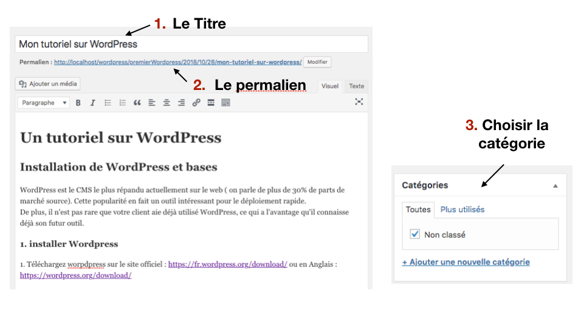
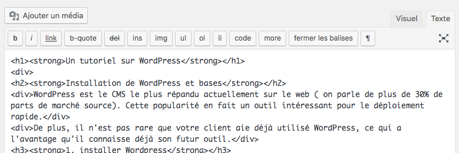
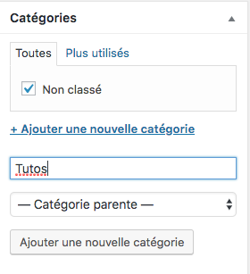
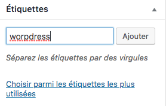
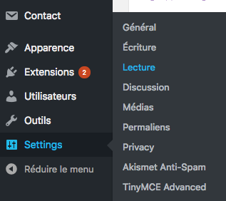
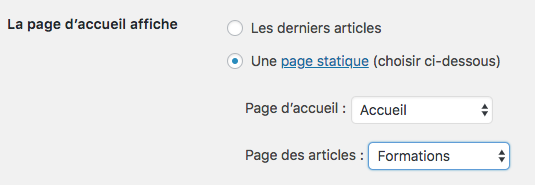
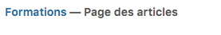

# Les articles

https://wpformation.com/article-wordpress/ 

Les articles servent à créer le contenu du site qui va évoluer au cours du temps. Ils sont datés, rattachés à un auteur et permettent aux utilisateurs de laisser des commentaires. Vous pouvez leur ajouter des catégories et les identifier avec des mots-clés.

Caractéristiques des articles :

- Ils apparaissent sur votre blog dans un ordre chronologique inversé (les plus récents en premier) si vous avez une partie blog sur votre site.
- Ils peuvent être classés dans des catégories pour mieux les organiser et créer des rubriques sur son blog.
- Ils peuvent comporter des étiquettes, c’est-à-dire des mots clés qu’on leur associe pour un classement encore plus fin du contenu de votre site. Par exemple, si vous avez une grande rubrique « Recettes de cuisine » qui regroupe des centaines de recettes, vous pouvez associer à vos articles des étiquettes comme « Pâtisserie », « Viande », « Poisson » pour permettre à vos lecteurs de trier plus finement les recettes.
- Ils figurent dans votre flux RSS : le flux RSS est le résumé des derniers articles de votre blog, les lecteurs peuvent s’y abonner pour être informés en temps réel de vos dernières publications ; ce flux RSS peut aussi servir à créer des newsletters automatiques qui reprennent les articles les plus récents de votre blog (=> plus d’informations sur les flux RSS).

## Editez un premier article

Allez sur l'onglet articles / Ajouter qui se trouve dans la barre latérale.

Lorsque vous écrivez un article, commencez par :

- Saisir le titre de votre nouvel article WordPress
- Optimiser le permalien (à des fins de SEO retirez les mots d’arrêt)
- Définir la catégorie et les éventuelles étiquettes
- Enfin, rédiger votre article

Installez l'extension `TinyMCE Advanced` pour avoir plus d'option de personnalisation de l'éditeur pour votre texte. (Voir liste d'extensions)



## L'éditeur Visuel et Texte

Vous pouvez choisir entre le mode visuel (par défaut WYSIWYG: ce que je vois, c'est ce que j'obtiendrai) et le mode Text qui vous montrera le contenu sous forme d'HTML et les balises utilisées.



## Catégories et étiquettes pour votre article WordPress

Lorsque l'on a beaucoup d'articles il est nécessaire de les classer/ catégoriser dans des catégories distinctes.

- Vous pouvez créer des `catégories` directement depuis votre article en cliquant sur `+Ajouter une nouvelle catégorie` ou directement depuis le menu `Articles / Catégories / Ajouter une nouvelle catégorie`

- Vous pouvez ajouter `une étiquette` (ou tag en anglais) directement depuis votre article en la saisissant directement dans la zone d’input (séparée d’une virgule si vous souhaitez en ajouter plusieurs) ou directement depuis le menu `Articles / Étiquettes / Ajouter une nouvelle étiquette.`

## Catégories

Les catégories sont surtout utilisées pour mettre en place une structure de base à partir des articles du site.

Imaginons que j'aimerais que mon article appartienne à une catégorie Tutos. Comme ça je pourrais facilement afficher tous les articles qui sont des tutoriels.

Mettons cela en place :

- Allez sur votre article
-  Cliquez sur `+Ajouter une nouvelle catégorie`



- Sauvegardez en cliquant sur le bouton `Ajouter une nouvelle catégorie`

## Etiquettes (les tags)

Les tags, connus aussi sous le nom d'étiquettes, sont comme des mots-clés. Pour l'instant notre article à comme catégorie Tutos. Et si je pouvais affiner cela ? Par exemple en lui donnant l'étiquette `wordpress`. Cela permettrai d'affiner la recherche si un utilisateur souhaite voir les articles qui sont des tutos et parlent de wordpress.



### Choisir sur quelle page va l'article

- J'ai crée une page formation. Je vais mettre mes articles sur cette page.
- Rendez vous dans Settings (reglage) / Lecture



- Dites sur quelle page vous voulez afficher vos articles



- Regardez à quoi ressemble visuellement votre page formations. Dans WordPress: cliquez sur l'onglet Pages
- La page article "appelle" bien nos articles



- Allez sur la page article et suivez le permalien pour voir le visuel de la page. Vous avez de

### Autoriser l'utilisateur à faire un commentaire


## Code à ajouter dans vos pages.php si vous en avez besoin

- Pour tester si on a des articles à afficher

```php
      <?php if (have_posts()) : ?>
	//ici, les articles à afficher
      <?php else : ?>
	//ici, le texte alternatif pour dire qu'il n'y a pas d'articles
      <?php endif; ?>

```

- Boucle des articles avec WHILE

```php
      <?php while (have_posts()) : the_post(); ?>
	// Pour chacun des articles à afficher
      <?php endwhile; ?>
´´´

- Titre d un article

`<?php the_title(); ?>`

- Extrait d un article `<?php the_excerpt(); ?>`

- Pour afficher une image associée à un article

````php
    if ( has_post_thumbnail() ) {
    the_post_thumbnail();
    }
´´´

## Sources, tutos

- https://wpformation.com/article-wordpress/#rediger-article
- https://wpformation.com/anatomie-articlepage-wordpress/ 