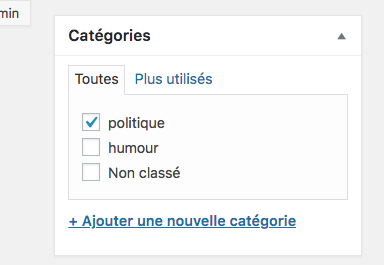

### Les articles

https://wpformation.com/article-wordpress/ 

Les articles servent à créer le contenu du site qui va évoluer au cours du temps. Ils sont datés, rattachés à un auteur et permettent aux utilisateurs de laisser des commentaires. Vous pouvez leur ajouter des catégories et les identifier avec des mots-clés.

Caractéristiques des articles :

- Ils apparaissent sur votre blog dans un ordre chronologique inversé (les plus récents en premier) si vous avez une partie blog sur votre site.
- Ils peuvent être classés dans des catégories pour mieux les organiser et créer des rubriques sur son blog.
- Ils peuvent comporter des étiquettes, c’est-à-dire des mots clés qu’on leur associe pour un classement encore plus fin du contenu de votre site. Par exemple, si vous avez une grande rubrique « Recettes de cuisine » qui regroupe des centaines de recettes, vous pouvez associer à vos articles des étiquettes comme « Pâtisserie », « Viande », « Poisson » pour permettre à vos lecteurs de trier plus finement les recettes.
- Ils figurent dans votre flux RSS : le flux RSS est le résumé des derniers articles de votre blog, les lecteurs peuvent s’y abonner pour être informés en temps réel de vos dernières publications ; ce flux RSS peut aussi servir à créer des newsletters automatiques qui reprennent les articles les plus récents de votre blog (=> plus d’informations sur les flux RSS).

#### Editez un premier article

Lorsque vous écrivez un article, commencez par :

- Saisir le titre de votre nouvel article WordPress
- Optimiser le permalien (à des fins de SEO retirez les mots d’arrêt)
- Définir la catégorie et les éventuelles étiquettes
- Enfin, rédiger votre article

Bon, c’est bien beau tout ça mais qu’est-ce que je peux bien raconter dans mon article ? Le sujet ou la forme peuvent varier, vous pouvez :

- raconter une histoire,
- faire du storytelling,
- partager une news,
- faire une revue pertinente,
- écrire un article comparatif,
- pondre un article de fond,
- proposer un tutoriel détaillé…

### Taxonomies, pour organiser son contenu

Au fur et à mesure que l'on ajoute du contenu à son CMS, on aura très vite envie d'organiser ce contenu, par exemple à l'aide de "**catégories**" et de "**mots-clefs**".  
C'est ce que l'on appelle des "**taxonomies**", autrement dit, des manières de regrouper du contenu similaire.

A ces articles et pages correspondent différentes manières de les regrouper. 

Les pages s'organisent en "pages" et "sous-pages". On parle de **relation hiérarchique** ou de relation "parent-enfant".

Pour les articles, WordPress propose deux **taxonomies**: "catégorie", et "mot-clef". Les catégories sont hiérarchiques (on peut avoir des catégories, contenant des sous-catégories contenant des sous-sous-sous-catégories, etc.). En général, on considère qu'il ne faut classer ses articles que dans une seule catégorie.

Les mots-clef par contre ne sont pas hiérarchiques et on considère qu'il vaut mieux associer à chaque article deux ou trois mots-clef (et non un seul). 
Les mots-clef permettent une navigation dans le contenu qui soit plus "transversale", alors que les catégories permettent une navigation plus structurée.

# Articles catégories et étiquettes

## Les articles

Les articles servent à créer le contenu du site qui va évoluer au cours du temps. Ils sont datés, rattachés à un auteur et permettent aux utilisateurs de laisser des commentaires. Vous pouvez leur ajouter des catégories et les identifier avec des mots-clés.

### Choisir sur quelle page va l'article

### Autoriser l'utilisateur à faire un commentaire

## Catégorie et étiquettes

Les catégories et les étiquettes (tags) concernent uniquement les articles : leur objectif est d’organiser le contenu du site et de faciliter la recherche des articles qui auraient disparu dans les archives du blog. Un article a toujours au moins une catégorie associée mais les étiquettes ne sont pas obligatoires.

### Les catégories

Une catégorie sert à recenser les articles qui s’y rapportent. Ex: le sujet de l'article; politique humour etc..

#### Gérer les catégories via le tableau de bord

- Parent : pour intégrer la catégorie B dans une catégorie existante A (B sera alors automatiquement classée comme une sous-catégorie de A)

### Gérer les catégories via l’éditeur d’article

- Pour associer l’article à une catégorie existante, cochez la case correspondante :
- Pour associer l’article à une catégorie qui n’est pas encore créée, cliquez sur ‘Ajouter une catégorie’.
- Sélectionner une catégorie parent pour hiérarchiser si nécessaire.

- Assurez-vous d’enregistrer les modifications avant de poursuivre votre navigation.

### Les étiquettes

Les étiquettes associées aux articles permettent à l’utilisateur d’effectuer une recherche précise.
Ex : j'ai un article trump est un fou. Sa catégorie est : politique. Son étiquette pourrait être Trump.

#### Gérer les étiquettes via le tableau de bord

#### Gérer les étiquettes directement dans l'article

