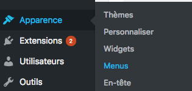
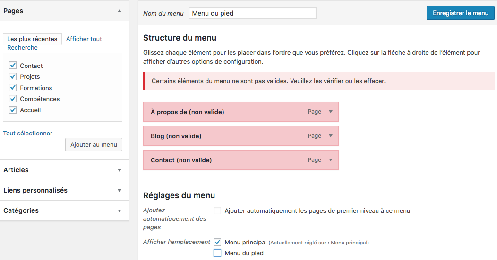
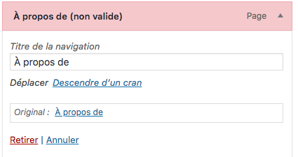
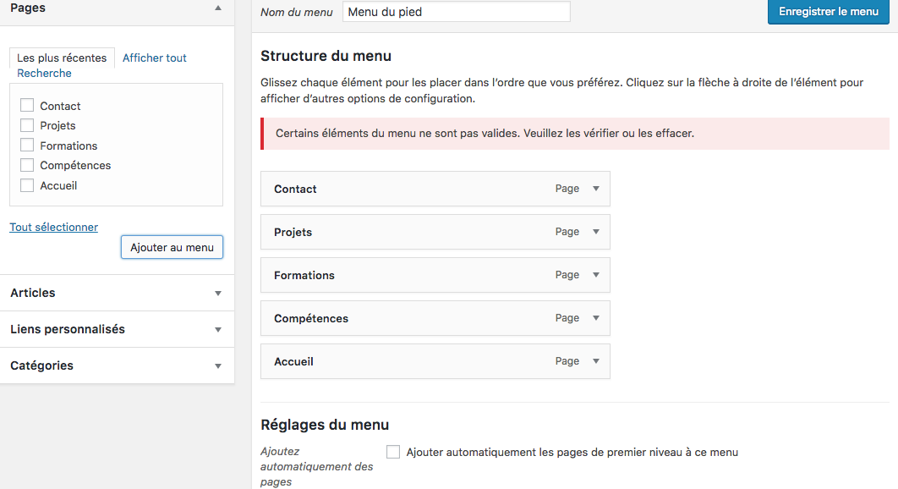

# Modifier le menu (la navigation)

J'aimerais avoir un menu avec chaque page que j'ai crée. Souvenez vous, nous avons une page Accueil, Contact, Projets, Formations et Compétences

- Retournez dans Apparence/ Menus

Modifiez les droits en ecriture : `sudo chmod -R 777 nomDossierWordpress`

- Choisissez le menu principal

- Retirez tout sauf Accueil (cliquez sur la petite fleche pour avoir la possibilité d'effacer)

- Cliquez sur `Ajouter au menu`
 
 Voici le Résultat. N'oubliez pas de cliquer sur `enregistrer le menu` pour sauvegarder.

- Cliquez en suivant l’ordre à droite
