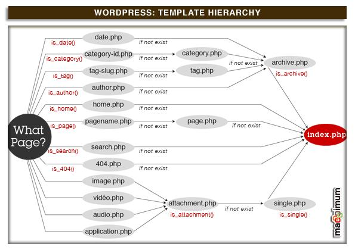

# Créer son propre thème : Introduction

Il existe déjà beaucoup de thème existant alors pourquoi créer son propre thème ? De plus se lancer dans une telle aventure demande pas mal de temps et d'énergie.. Voici les avantages de créer son propre thème :

- C'est créer son propre univers, avec le look que l'on veut,
- d'un point de vue technique cela aide à l'apprentissage et la compréhension profonde de WordPress
- C’est une excellente opportunité pour mieux connaître et comprendre le XHTML, CSS et PHP.

Pour créer un thème, il faut commencer par ajouter un dossier avec le nom de votre thème dans le répertoire wp-content/themes.

Dans WordPress, un thème a une structure assez simple, car il ne nécessite qu'au minimum, deux fichiers !

Aide : [theme vide](http://underscores.me/)

! il s'agit d'un thème. Il faut donc télécharger worpdress précédemment et mettre le dossier au bon endroit.

## Présentation des fichiers templates

Donc, aujourd’hui nous allons commencer à s’intéresser de plus près au blog sous WordPress et notamment à son thème et à ses templates. Tout d’abord, il faut savoir qu’un thème pour WordPress est composé de 3 éléments:

- la ou les `feuilles de style`: c’est ce qui va donner le style, l’apparence que vous voulez à votre blog. Ce sont ce qu’on appelle les CSS, les Cascading Style Sheets.
- les `images`: on va trouver dans le thème toutes les images utilisées par la feuille de style pour habiller votre blog.
- les `Templates`: ce sont les fichiers, les différents éléments en PHP, qui vont composer la page web de votre blog visuellement. Les plus connus sont le `header`, `index`, `sidebar` et `footer` . Voyons un peu plus en détail ce que comportent ces 4 fichier PHP :

- `Le Header` (header.php) :  il contient toutes les infos figurant en haut de votre blog. On y trouve notamment les infos contenues par la balise <head> comme le DocType, les balises META, les liens vers les feuilles de styles CSS, ainsi que d’autres infos utiles pour un bon référencement de votre blog. En bref, le header héberge les infos importantes pour un bon affichage de votre blog dans un navigateur. Enfin, le header comporte l’entête de votre blog, avec son titre et sa description.

- `L'index` (index.php) : il contient le contenu de votre blog, vos articles et différentes pages.

- `la sidebar` (sidebar.php) : C’est la colonne qui va afficher différentes informations comme la blogroll, les derniers articles, les derniers commentaires, soit tout l’ensemble de widgets pour une meilleure navigation dans le blog. Elle pourra se trouver à gauche, à droite ou au-dessous du contenu. D’un point de vue codage, elle sera située entre le contenu et le footer.

- `le footer` (footer.php) : Situé en bas de page (comme son nom l’indique), il « ferme » la page et contient différentes informations comme celles de copyright, de l’auteur ou encore de la plateforme utilisée.

### Hiérarchie des templates

Source : http://www.fran6art.com/tutoriels/creation-theme-wordpress-tutorial-4-hierarchie-des-templates/

Voici la liste de tous les templates utilisables avec un blog WordPress: home.php, single.php, yourname.php, page.php, category.php, category-6.php, author.php, date.php, search.php, 404.php, archive.php et index.php.



Pour bien comprendre la hiérarchie des templates sous WordPress, il suffit de comprendre le raisonnement suivant: Tout template créé réfère à index.php. C’est le template, le fichier central. Ca veut dire que si un visiteur arrive directement sur la page d’un article (single.php) et que ce fichier n’existe pas, il sera directement renvoyé vers le fichier index.php. Ainsi, vous pourrez créer autant de templates que vous voudrez dans la liste proposée par ce schéma, il vont tous être sous la « responsabilité » de l’index.php.

# Créer son propre thème : Création des templates

Les dossiers thèmes se trouvent sous wp_content / themes

## 1. Création du header et de l'index

### header.php

Nous allons commencer par le HEADER (header.php) et l’INDEX (index.php). Pourquoi ? Parce que c’est le header qui contient les informations de base qui vont permettre à la page web de bien s’afficher dans le navigateur. Le header comprend notamment:

- le DOCTYPE, qui nous fournit les informations sur le codage utilisé par la page web,
- la balise HEAD et tout ce qu’elle comporte: les balises META, le titre du blog, le lien vers la feuille de style et vers les flux RSS.
- L’ouverture de la balise BODY.

Toutes ces informations sont les bases pour créer votre blog. Sans le doctype, le navigateur ne saura pas quoi ni comment afficher la page web. Sans la balise HEAD et ses différentes infos, le navigateur ne saura pas non plus quel type de code utiliser, comment s’appelle le blog, où sont les infos de style et s’il y a un flux RSS. Bref, c’est la base de la base. Sans ça, on ne va nulle part.

Pour ce faire WordPress utilise des marqueur de modèle

`<h1><?php bloginfo('name'); ?></h1> `

__Qu'est-ce qu'un Marqueur de Modèle ?__

Un marqueur de modèle est une instruction qui demande à WordPress de "faire" ou "d'obtenir" quelque chose. Dans le cas du marqueur de modèle de header.php pour afficher le nom de votre site WordPress, il ressemble à :  

`<h1><?php bloginfo('name'); ?></h1>`


```html

<!DOCTYPE html>
<!--[if IE 7]>
<html class="ie ie7" <?php language_attributes(); ?>>
<![endif]-->
<!--[if IE 8]>
<html class="ie ie8" <?php language_attributes(); ?>>
<![endif]-->
<!--[if !(IE 7) & !(IE 8)]><!-->
<html <?php language_attributes(); ?>>

<head>
    <meta charset= "<?php bloginfo('charset'); ?>">
    <meta name="viewport" content="width=device-width, initial-scale=1.0">
    <meta http-equiv="X-UA-Compatible" content="ie=edge">
    <?php wp_head(); ?>
</head>

<body <?php body_class(); ?> >
    <h1><?php bloginfo('name'); ?></h1> 

```

`<h1><?php bloginfo('name'); ?></h1>` 

Le __marqueur de modèle__ est `<?php bloginfo(); ?>` entouré par une balise de titre __H1__. Le marqueur `bloginfo()` *obtient* l'information depuis votre `Profil Utilisateur` et `Options > Général` dans le panneau d'administration. Dans l'exemple actuel, le mot *name* à l'intérieur des apostrophes dans le marqueur lui demande "d'obtenir le nom du site du blog". On appelle cela un __paramètre__.

__Quelques marqueurs de modèle__

__Informations générales sur le site__

Pour afficher la description : `<?php bloginfo('description'); ?>`
Pour afficher l'url : `<?php bloginfo('url'); ?>`
Pour afficher la version de WordPress que vous utilisez : `<?php bloginfo('version'); ?>` . Exemple : 
`<p>Propulsé par WordPress version <?php bloginfo('version'); ?></p>`

__Informations sur un article__

Le titre de l'article : `<?php the_title(); ?>`

Pour en savoir plus sur les Marqueurs de Modèle : https://codex.wordpress.org/fr:Decouvrir_les_Marqueurs_de_Modele

### index.php

On va travailler tout de suite dans l’index parce que c’est le fichier central du thème. C’est chez lui que l’on va dire où aller chercher l’information. C’est donc dans ce template que l’on va dire d’aller dans le header.php pour trouver les informations de base pour notre thème.

En fait, l’index va nous donner les instructions pour nous permettre d’aller chercher les informations au bon endroit. Ici, on va commencer par lui dire d’aller chercher les infos du header dans le template header,php. Pour cela, on va utiliser des template tags. Les template tags sont des petits morceaux de code en PHP qui cont relier les fichiers entre eux. Ici, ce petit bout de code va être inséré dans l’index et va nous dire que l’info concernant le header se trouve dans le fichier header.php. Cette ligne de code c’est la suivante:

```PHP

<?php get_header(); ?> /* Va me chercher le fichier header.php */
<?php get_sidebar(); ?> /* Va me chercher le fichier sidebar.php */
<?php get_footer(); ?> /* Va me chercher le fichier footer.php */

```

## 2. Le fichier style.css

Le fichier style.css permet de déclarer le thème auprès de WordPress ; on y renseignera notamment le nom du thème, l'auteur et le site Internet, ou encore un numéro de version.

```CSS
/*
Theme Name: Le thème de Marie
Author: Marie Thielens
Author URI: https://github.com/marieThielens
Description: Notre premier thème WordPress !
Version: 1.0
*/
```

ce fichier contiendra aussi le css normal

## 3. Le fichier functions.php

c'est le fichier functions.php qui contient des fonctions aidant à l'affichage dans un thème donné.

1. Appel du fichier style.css

```php

<?php

function fonctionAppelCss(){
    wp_enqueue_style('style_de_mon_parent', get_template_directory_uri() . '/style.css'  );
}
add_action('wp_enqueue_scripts', 'fonctionAppelCss');

```

## Sources :

- Tuto : http://www.fran6art.com/wordpress/creez-votre-theme-wordpress-de-a-a-z/
- 