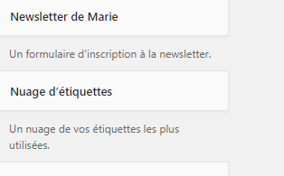
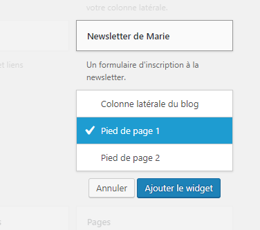
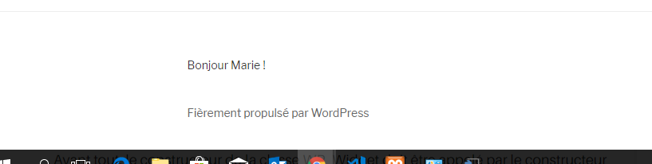
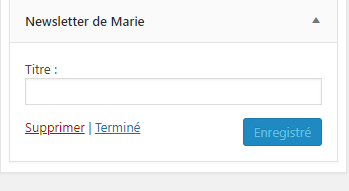
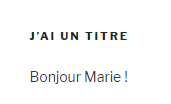

# Créer des widgets : un widget d'inscription à une newsletter(un plugins que l'on a crée)

# 1. Créer sa nouvelle zone de widget

Dans votre theme, dans le fichier function.php :

```php
// Les widgets
function widget_initialiser(){
    // register_sidebar : permet de définir une nouvelle zone de widgets
    register_sidebar(array(
        'name' => 'Footer Widget1',
        'id' => 'footer_widget1',
        'before_widget' => '<div class="footer_widget1">',
        'after_widget' => '</div>',
        'before_title' => '<h4>', 
        'after_title' => '</h4>',
    ));
    register_sidebar( array(
        'name' => 'Footer Widget2',
        'id' => 'footer_widget2',
        'before_widget' => '<div class="Footer Widget2">',
        'after_widget' => '</div>',
        'before_title' => '<h4>',
        'after_title' => '</h4>',
	));
	register_sidebar( array(
        'name' => 'Footer Widget3',
        'id' => 'footer_widget3',
        'before_widget' => '<div class="Footer Widget3">',
        'after_widget' => '</div>',
        'before_title' => '<h4>',
        'after_title' => '</h4>',
	));
	register_sidebar( array(
        'name' => 'Footer Widget4',
        'id' => 'footer_widget3',
        'before_widget' => '<div class="Footer Widget4">',
        'after_widget' => '</div>',
        'before_title' => '<h4>',
        'after_title' => '</h4>',
    ));
    
}
add_action('widgets_init', 'widget_initialiser');
```

Nos zones de widgets apparraissent maintenant dans Apparence/Widgets


## 2. Déclarer le widget, mode d'emploi

Dans wp-content/ plugins/ mariePlugin(dossier que j'ai crée)/ newsletterwidget.php (fichier que j'ai crée).

```PHP
class Marie_tuto_widget extends WP_Widget 
{
    // //la construction du widget: id widget, titre widget, descritpion widget
    public function __construct()
    {
	    parent::__construct('id_widget', 'titre_widget', array('description' => 'La description du widget'));
	}
    // le front-end du widget, ce que l'on verra sur le site et non le dashboard
    public function widget($args, $instance)
    {
        // Contenu du widget
    }
    // Nou devons 
    public function update($new_instance, $old_instance)
    {
        // Modification des paramètres du widget
    }
    // L'arrière plan, ce que l'on verra dans le dashbord
    public function form($instance){
        // Définition des paramètres du widgets
    }
}
```

## 3. Déclarer le widget

Dans wp-content/ plugins/ mariePlugin(dossier que j'ai crée)/ newsletterwidget.php (fichier que j'ai crée).

On va le faire proprement avec les classes. Créez un dossier mariePlugin dans wp-content (voir point 9). Dedans créez un fichier newsletterwidget.php. Nous allons y mettre la classe de notre objet.

Tous les widgets sont des objets qui doivent hériter de la classe WP_Widget (déclarée dans le fichier wp-includes/widgets.php).
`class Marie_Newsletter_Widget extends WP_Widget`

```PHP
class Marie_Newsletter_Widget extends WP_Widget
{
    public function __construct()
    {
        //la construction du widget: id widget, titre widget, descritpion widget
        parent::__construct('marie_newsletter', 'Newsletter de Marie', array('description' => 'Un formulaire d\'inscription à la newsletter.'));
    }
    
    // Creation du front-end, du contenu du widget (ce qu'on verra sur le site et non dans le dashboard)
    public function widget($args, $instance)
    {
        // Va mettre le texte ..
        echo __( 'Bonjour Marie !', 'wpb_widget_domain' );
    }
}
add_action('widget_init', function(){register_widget('Marie_Newsletter_widget'); });
```

### Il faut inclure ce fichier dans le fichier principal : mariePlugin.php 

Dans wp-content/ plugins / mariePlugin(dossier que j'ai crée) / mariePlugin.php (fichier que j'ai crée).

- mariePlugin.php est un fichier prinicpal. Comme je vais surement créer plusieurs plugins je fais un fichier principal qui les appelle. Un peu comme lorsqu'on fait un footer et qu'on l'include.

```PHP
        include_once plugin_dir_path( __FILE__). '/newsletterwidget.php';
        new Marie_Newsletter(); 
```

On voit que le widget est apparu dans la zone de widget :




Activez le et allez voir sur le site : 



Mon echo y est bien :)

## 4. Le visuel du widget : la méthode form()

On va rajouter ce code pour que l'utilisateur puisse mettre un titre (input)

```PHP

<?php
class Marie_Newsletter_Widget extends WP_Widget
{
    public function __construct()
    {
        parent::__construct('marie_newsletter', 'Newsletter de Marie', array('description' => 'Un formulaire d\'inscription à la newsletter.'));
    }
    
    // Creation du front-end widget (ce qu'on verra sur le site et non dans le dashboard)
    public function widget($args, $instance)
    {
        // le visuel du titre
       $title = apply_filters( 'widget_title', $instance['title'] );
        echo $args['before_widget'];
        if ( ! empty( $title ) )
        echo $args['before_title'] . $title . $args['after_title'];
        
        // Ce que l'on voit sur le site
        echo __( 'Bonjour Marie !', 'wpb_widget_domain' );
        echo $args['after_widget'];
    }

    // L'arrière plan du widget avec la méthode form(), les paramètres du widgets
    public function form($instance)
    {
        // Si l’utilisateur fournit un titre, ce titre sera inséré dans le formulaire HTML que nous avons créé
        $title = isset($instance['title']) ? $instance['title'] : '';
        ?>
        <p>
            <label for="<?php echo $this->get_field_name( 'title' ); ?>"><?php _e( 'Title:' ); ?></label>
            <input class="widefat" id="<?php echo $this->get_field_id( 'title' ); ?>" name="<?php echo $this->get_field_name( 'title' ); ?>" type="text" value="<?php echo  $title; ?>" />
        </p>
        <?php
    }
 }

```




Nous devons implémenter la fonction de mise à jour pour actualiser le widget chaque fois que les paramètres sont modifiés.

```PHP

    // update = modification des paramètres du widget.
    public function update( $new_instance, $old_instance ) {
        $instance = array();
        $instance['title'] = ( ! empty( $new_instance['title'] ) ) ? strip_tags( $new_instance['title'] ) : '';
        return $instance;
        }

```

## 5. Faire apparaître vos widget dans vos pages/footer etc..

Pour l’instant, votre nouvelle zone de widget existe et est déjà disponible depuis votre administration à l’onglet Apparence > Widget. Toutefois, elle n’apparaîtra pas du côté visiteur tant que vous ne l’aurez pas ajouté dans le fichier concerné.

Dans themes/votreTheme/footer.php

```php
 <!-- ajout de ma nouvelle widget area -->
 <?php if ( is_active_sidebar( 'footer_widget1' ) ) : ?>

 <div id="footer_widget1">
    <?php dynamic_sidebar( 'footer_widget1' ); ?>
 </div>

 <?php endif; ?>


```
En faire de même pour les autres zones
