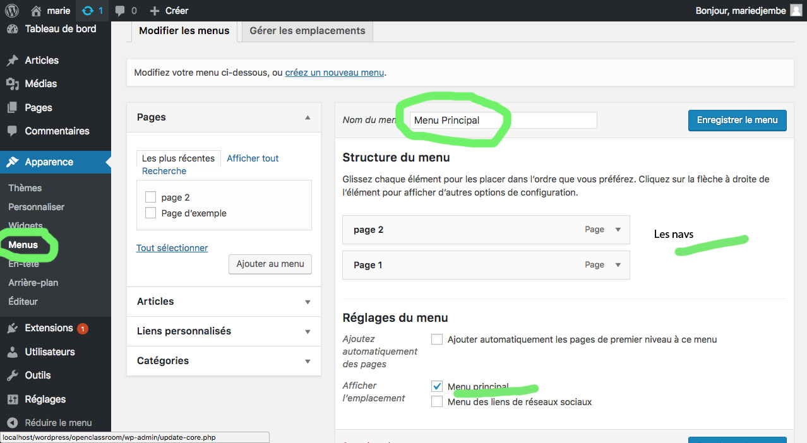
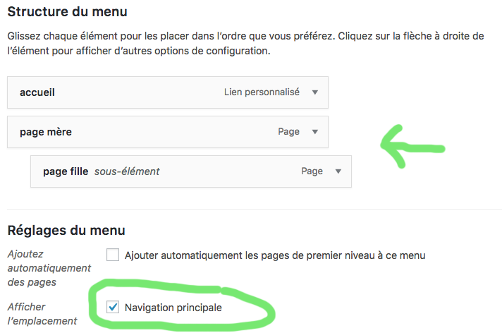
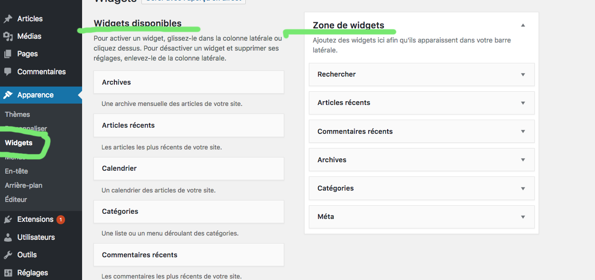

# Thèmes, menus et widgets


## Thèmes 

Le thème est le visuel, l'apparence de votre site

1) Personnaliser votre thème :


Varie selon les thèmes : 

- __identité du site__ : Nom du site, logo, sloggan,Icône du site etc.. 
- __Couleur__ : couleur fonc, texte etc..
- __Image d'en-tête__
- __Menus__ : Navigation
- __Widgets__ : barre de recherche, articles etc..
- __Réglages de la page d'accueil__
- __CSS additionnel__

N'oubliez pas de cliquer sur le bouton enregistrer et publier pour sauvegarder.

## Menus (La navigation)



- Donnez un nom à votre menu
- Réglages menu : l'emplacement de la nav est définie par le thème. Ici menu principal c'est dans la partie gauche et reseaux sociaux dans le footer
- Lien personnalisés(à gauche): les liens vers un site externe
- Cathégorie : par tag
- faire des sous-menus et définir un menu comme le menu principal :



## widgets 

Les widgets sont des petits modules que vous pouvez insérer dans les barres latérales, le footer. Exemple : un calendrier, une barre de recherche



Créez des widgets : voir fichier 9

### Widgets par défaut de wordpress

- Le widget Archives : Ce premier widget sert à afficher les archives mensuelles de votre site. Si votre site est récent (moins de 6 mois), je vous déconseille fortement de l’utiliser.
- Le widget Atricles récents :  permet d’afficher la liste des derniers articles parus sur votre blog.
- Le widget Calendrier :  sert à intégrer un calendrier qui affiche la date du jour. (sert pas à grand chose)
- Le widget Catégories : Le widget Catégories sert à afficher la liste des catégories de votre site (crées dans Articles > Catégories).
- Le widget Chercher : pour que le visiteur puisse faire des recherches
- Le widget Commentaires récents : Ce widget sert à afficher la liste des derniers commentaires publiés par vos visiteurs.
- Le widget Flux : Le widget Flux sert à afficher le contenu d’un flux RSS sur votre site. Pour information, un flux RSS correspond à la liste des articles d’un blog ou d’un site d’actualités (Sauf si vous tenez à envoyer vos visiteurs sur un autre site, ce widget n’est pas vraiment utile).
- Le widget Menu personnalisé : Si le menu de votre site est trop étroit, vous pouvez utiliser ce widget pour afficher un menu complémentaire.
- Le widget Méta : le widget Méta affiche une série de liens utiles au webmaster du site (en l’occurence vous).
- Le widget Nuage de mots-clés : Ce widget sert à afficher un florilège des mots-clés ou catégories utilisés sur votre site. Chaque mot-clé aura une taille proportionnelle au nombre de fois où il est utilisé.
- Le widget Pages : Le widget Pages permet d’afficher la liste des pages de votre site. (Ce widget devait être utile avant que le widget Menu personnalisé fasse son apparition.)
- Le widget Texte : Ce dernier widget permet d’afficher du texte et n’importe quel contenu de type HTML (le PHP ne sera pas interprété). On peut s’en servir pour afficher un encart J’aime de Facebook, un formulaire d’inscription à une newsletter ou beaucoup d’autre choses.

Pour y faire figurer des images, vous devrez utiliser le HTML. Allez je vous aide pour cette fois. Voici comment y intégrer une image :

```HTML

<!--  Image alignée à droite : -->

<!--  Image alignée à gauche : -->


```


