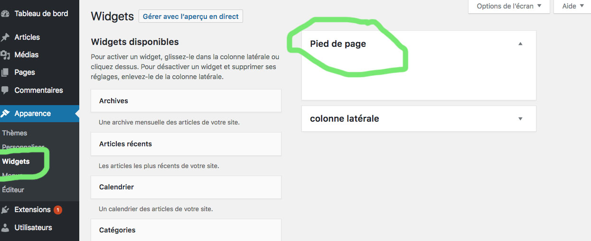

# Fichier fonction.php

## Widgets

```PHP
<?php
function widget_initialiser()
{
    register_sidebar(array( /* Défini la nouvelle zone de widgets*/
        'id' => 'footer_texte', /* un id unique qui servira à afficher la zone */
        'name' => 'footer', /* le nom de la zone qui sera affiché dans l'administration  */
        'description' => 'Apparait en bas du site', /* le texte à afficher sur la page de gestion des widgets  */
        'before_widget' => '<div class="footer_texte">', /* code HTML à afficher avant chaque widget ; */
        'after_widget' => '</div>', /* code HTML à afficher après chaque widget ; */
        'before_title' => '<h1>', /* code HTML à afficher avant chaque titre de widget  */
        'after_title' => '</h1>' /* code HTML à afficher après chaque titre de widget. */
    ));
}
add_action('widgets_init','widget_initialiser');
```

Résultat : 



Une fois la zone de widgets créée, vous pouvez l'afficher où bon vous semble dans votre thème avec un appel à dynamic_sidebar(), prenant en paramètre l'id de la zone choisie.

```<div><?php dynamic_sidebar('footer_texte');?></div>```

## Ajouter un menu (une navigation)

```PHP

<?php
function site_nav()
{
    register_nav_menu('main_menu', 'Menu principal'); /* enregistre le menu(l'identifiant du menu(unique), libellé du menu(texte), qui sera affiché dans le panneau d'administration )*/
}
add_action('init', 'site_nav');

```

L'appeler :

`<?php wp_nav_menu(array('theme_location' => 'main_menu'));`