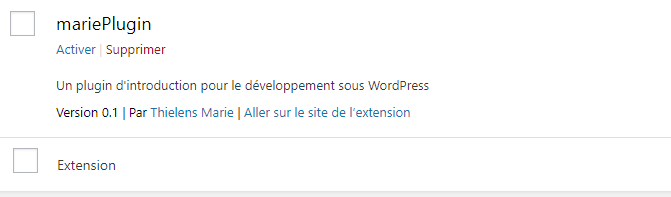

# Créer des pluggins/ des extensions

## Déclarer le pluggin

- Dans le dossier wp-content/pluggin créez un dossier avec le nom de votre pluggin. Moi je vais l'appeler mariePlugin.
- Dans ce dossier, créez un premier fichier mariePlugin.php
- Pour que le plugin soit reconnu par WordPress, il faut nécessairement déclarer au moins son nom dans le fichier principal

```PHP

<?php
/*
Plugin Name: mariePlugin
Plugin URI: http://mariePlugin.com
Description: Un plugin d'introduction pour le développement sous WordPress
Version: 0.1
Author: Thielens Marie
Author URI: http://www.thielens-marie.be
License: GPL2
*/

```

- Plugin URI : l'adresse du site de votre plugin décrivant son fonctionnement et donnant des informations complémentaires ;
- Description : un paragraphe de description du plugin, affiché en parcourant la liste des plugins ;
- Version : la version du plugin ;
- Author : votre nom ;
- Author URI : l'adresse de votre site ;
- License : un nom de licence pour le code du plugin.

**Note de sécurité: Prenez en compte le fait de bloquer l'accès direct aux fichiers PHP de votre Extension en ajoutant la ligne suivante au début de chacun d'entre eux.**

`defined( 'ABSPATH' ) or die( 'No script kiddies please!' );`

- Dans wordpress si vous allez dans extension vous voyez maintenant votre plugin :



Activez la.

## Nos premières fonctions

1. Changer le title du site

```PHP
add_filter('pre_get_document_title', 'change_the_title');
function change_the_title() {
    return 'Le titre changé Marie';
}

```


Utiliser les classes pour que ce soit plus propre

```PHP
class MariePlugin
{
    public function __construct()
    {
        add_filter('pre_get_document_title', array($this, 'change_the_title'));
    }
    function change_the_title() {
        return $title . 'Le titre changé Marie';
    }

}
new MariePlugin();

```

### Une structure multifichiers

Pour structurer il vaut mieux mettre dans plusieurs fichiers différents.

- un fichier central
- plusieurs fichiers chacun avec leurs propres rôles

La tâche du fichier mariePlugin.php sera de charger, d'appeler les fichiers nécessaire au chargement du plugin.
Creéz un fichier pageTitle.php (dans le dossier du plugin le mien est tjs mariePlugin)

Voici le code final

1. Le fichier mariePlugin.php

```PHP

class MariePlugin
{
    public function __construct()
    {
        // Va me chercher me fichier pageTitle
        include_once plugin_dir_path( __FILE__ ).'/pageTitle.php';
        // Dans ce fichier prend moi la classe
        new MariePlugin_Page_Title();
    }
}
new MariePlugin();

```

2. Le fichier pageTitle.php

```PHP

class MariePlugin_Page_Title
{
    public function __construct()
    {
        add_filter('pre_get_document_title', array($this, 'change_the_title'));
    }
    function change_the_title() {
        return $title . 'Le titre changé Marie';
    }
}

```

## Un plugin de newsletter

dans le dossier mariePlugin créez un fichier newsletter.php

