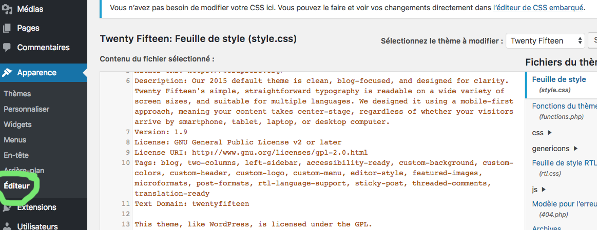

# worpdress

## Bonne pratique de sécurité

1) __Fichier .htaccess__

Empêcher d'écrire dans l'url (wp-admin) par exemple.

    <Files wp-config.php>
       order allow,deny
       deny from all
    </Files>

    Options All -Indexes

    <Files .htaccess>
       order allow,deny 
       deny from all 
    </Files>

2) __Plugins__

- **SF Move Login** : Changez l’url de votre page de connexion.
- **Login Lockdown** : pour limiter le nombre d'essais possibles lorsque que l'on essaye de se connecter à la partie administration et que l'on se trompe de mot de passe.
- **Theme Authenticity Checker** : pour vérifier le code des thèmes que vous pourrez installer sur votre CMS.

3) __Readme.html__

Supprimer le fichier readme.html (à la racine). Il donne beaucoup d'informations à quelqu'un qui souhaiterait attaquer votre site !

4) __function.php__

Dans le fichier function.php (wp-content / themes / LeTheme / function.php) ajouter ceci :

    add_filter('login_errors', create_function('$a', "return null;"));
    remove_action('wp_head', 'wp_generator');

5) __header.php__

Dans le fichier header.php enlever la ligne :
`<meta name="generator" content="WordPress <?php bloginfo('version'); ?>" />`

## Modifier le css et les pages.php

