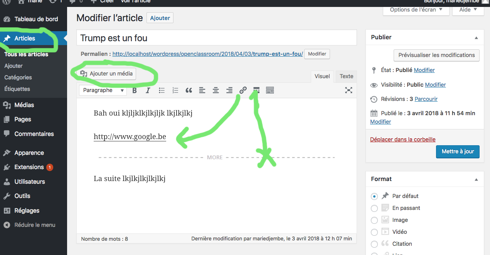
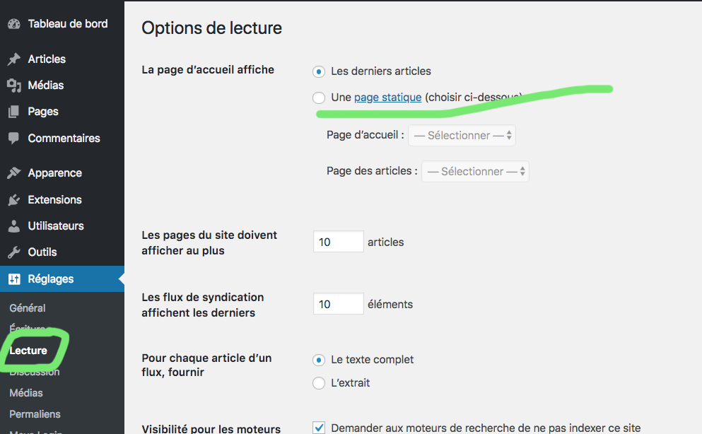

# Articles catégories et étiquettes

## Les articles

Les articles servent à créer le contenu du site qui va évoluer au cours du temps. Ils sont datés, rattachés à un auteur et permettent aux utilisateurs de laisser des commentaires. Vous pouvez leur ajouter des catégories et les identifier avec des mots-clés.

### Choisir sur quelle page va l'article

### Autoriser l'utilisateur à faire un commentaire

## Catégorie et étiquettes

Les catégories et les étiquettes (tags) concernent uniquement les articles : leur objectif est d’organiser le contenu du site et de faciliter la recherche des articles qui auraient disparu dans les archives du blog. Un article a toujours au moins une catégorie associée mais les étiquettes ne sont pas obligatoires.

### Les catégories

Une catégorie sert à recenser les articles qui s’y rapportent. Ex: le sujet de l'article; politique humour etc..

#### Gérer les catégories via le tableau de bord

;

- Parent : pour intégrer la catégorie B dans une catégorie existante A (B sera alors automatiquement classée comme une sous-catégorie de A)

### Gérer les catégories via l’éditeur d’article

;

- Pour associer l’article à une catégorie existante, cochez la case correspondante :
- Pour associer l’article à une catégorie qui n’est pas encore créée, cliquez sur ‘Ajouter une catégorie’.
- Sélectionner une catégorie parent pour hiérarchiser si nécessaire.

- Assurez-vous d’enregistrer les modifications avant de poursuivre votre navigation.

### Les étiquettes

Les étiquettes associées aux articles permettent à l’utilisateur d’effectuer une recherche précise.
Ex : j'ai un article trump est un fou. Sa catégorie est : politique. Son étiquette pourrait être Trump.

#### Gérer les étiquettes via le tableau de bord

;

#### Gérer les étiquettes directement dans l'article

;