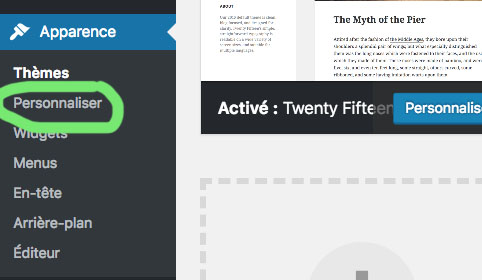

# Thèmes, menus et widgets

## Thèmes 

Le thème est le visuel, l'apparence de votre site

1) Personnaliser votre thème :

Varie selon les thèmes : 

- __identité du site__ : Nom du site, logo, sloggan,Icône du site etc.. 
- __Couleur__ : couleur fonc, texte etc..
- __Image d'en-tête__
- __Menus__ : Navigation
- __Widgets__ : barre de recherche, articles etc..
- __Réglages de la page d'accueil__
- __CSS additionnel__

N'oubliez pas de cliquer sur le bouton enregistrer et publier pour sauvegarder.

## Menus

__La navigation__

- Donnez un nom à votre menu
- Réglages menu : l'emplacement de la nav est définie par le thème. Ici menu principal c'est dans la partie gauche et reseaux sociaux dans le footer
- Lien personnalisés(à gauche): les liens vers un site externe
- Cathégorie : par tag

- faire des sous-menus et définir un menu comme le menu principal :

## widgets 

Les widgets sont des petits modules que vous pouvez insérer dans les barres latérales, le footer. Exemple : un calendrier, une barre de recherche

